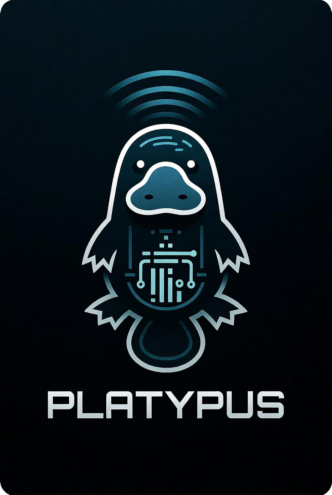

# Platypus



[](https://github.com/FuzzyGophers/platypus/actions/workflows/ci.yml)
[](LICENSE)
[](https://reuse.software/)

**A location-first programming manager for radios.** A zero-dependency Rust engine at its
core (reusable across platforms) that also ships a native macOS app, with a pluggable
per-model device-profile system.

## What it's for

The usual way to program a radio is device- and system-centric: import everything a region
has, then prune away what you don't want — often in vendor software tied to one platform.
Platypus inverts that. Tell it **where** and **what** you care about (a place, a point and a
radius, the kinds of activity you want) and it gives you just those results, ready to program
onto the device.

The goal is **many ways to add data × many ways to filter it**:

- **Add** — pull data from the device itself and from other sources, behind one provider
  interface.
- **Filter** — geographic drill-down, point + radius, service type, technology, band,
  frequency, free-text; composable and saved, not one fixed workflow.

The engine is model-agnostic: a pluggable device-profile system that already spans more than
one device *class*, so adding a radio is a profile, not a rewrite. See
[supported devices](docs/radios/).

## Why "Platypus"?

The platypus is the animal that refuses to fit a category — a mammal that lays eggs,
with a duck's bill, a beaver's tail, and an otter's feet. An improbable assembly of
parts from everywhere that nonetheless works as one coherent creature. That's the
project: many disparate pieces (a serial protocol, a byte-exact file format, a SOAP
web service, a SQLite store, a Rust core, a SwiftUI app) stitched into a single tool,
and a deliberate refusal of the conventional, system-centric category in favor of
something location-first.

And the detail that makes it more than a pun: the platypus hunts by **electroreception**
— it closes its eyes underwater and finds prey by sensing the faint electrical signals
they give off. A creature that navigates the world by listening for signals no one else
can. For an app built around pulling order out of the radio spectrum, the name picked
itself. (It's in the logo: a platypus, radiating.)

## Build

```sh
git clone https://github.com/FuzzyGophers/platypus.git
cd platypus
```

The Rust engine is a standalone Cargo workspace — it builds and tests on any platform with
**nothing but `cargo`** (no extra build tooling):

```sh
cargo test   # the core + FFI
```

### macOS app

The SwiftUI app has its own build front, driven by [`just`](https://just.systems) (a task
runner) — it consumes the prebuilt Rust FFI static lib and the generated C header:

```sh
just app::build     # build the app
just app::run       # build + run
just app::bundle    # assemble Platypus.app (signed if CODESIGN_IDENTITY is set)
open apps/PlatypusMac/Platypus.app
```

### Checks

`just check` runs the full local quality gate — `rustfmt`, `clippy -D warnings`,
`cargo test`, [REUSE](https://reuse.software) license compliance, `cargo-deny`
(dependency license/advisory policy), an offline doc-link check, a
[cbindgen](https://github.com/mozilla/cbindgen) header-freshness gate, and a macOS app build
+ headless smoke test:

```sh
just check
```

It detect-and-skips the optional tools if absent (`brew install just`,
`cargo install cbindgen`, `pipx install reuse`, `brew install cargo-deny lychee`). The repo
is **REUSE-compliant**, and the same fronts run in CI
([`.github/workflows/ci.yml`](.github/workflows/ci.yml)).

## License

Platypus is free software, licensed under the **GNU General Public License, version 2**
([`LICENSE`](LICENSE), SPDX `GPL-2.0-only`). You may use, study, share, and modify it; if
you distribute a modified version (including a front-end built on `platypus-core`) you
must release your source under the same license. There is no warranty.

Credit for the external specifications and references we consulted, and our **facts-only**
sourcing policy (we take facts from references, never their code), is in
[`CREDITS.md`](CREDITS.md).

## Data

Platypus ships **no radio data** and redistributes none — it works on data **you** provide. It
reads only what's already on your own device or what you supply, obtained through the
manufacturer's own tools; it never bundles, downloads, or redistributes that data. For network
sources Platypus is a *client*, not a rival dataset — each user authenticates with **their own**
account, and nothing is re-served.

---

See [`CLAUDE.md`](CLAUDE.md) for the cold-start brief + doc router. Detailed references live
in [`docs/`](docs/) — [architecture](docs/architecture.md), [capabilities](docs/capabilities.md),
[data sources](docs/sources.md) (and how we [respect them](docs/respecting-sources.md)), and the
[supported devices](docs/radios/).
